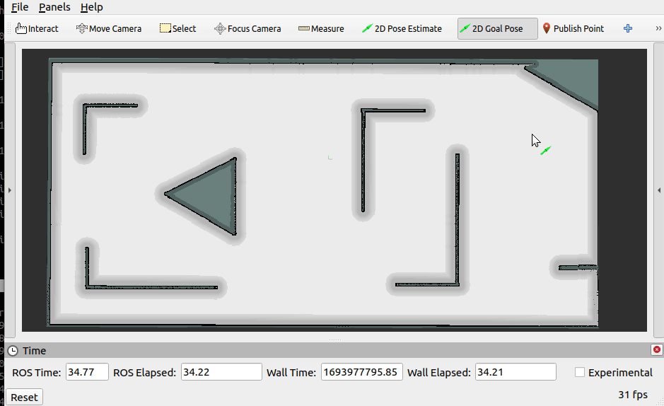

# 一起动手写ROS仿真器


本仓库是《一起动手写ROS仿真器》系列教程的代码和示例集合。这个教程旨在帮助你从零开始，逐步添加功能，最终完整实现一个用于ROS平台**机器人导航规划控制功能**的ROS仿真器
**备注: 虽然开发环境使用的galactic，但是整个工程在ROS2的各版本上是可以直接使用的，不必区分版本**

## 简介
ROS（Robot Operating System）是一个广泛使用的机器人开发平台，提供了一系列工具和库，用于构建机器人应用程序。在本教程中，我们将使用ROS来开发一个仿真器，模拟机器人在虚拟环境中的运动和感知。

## 教程目录

[bilibili](https://space.bilibili.com/554016964/channel/collectiondetail?sid=1560370)

[在线文档](https://nav-simulator.readthedocs.io/en/latest/)

由于上面文档平台有一些公式的显示问题我没有搞定，如果对公式感兴趣，可以看下面的链接。内容都是一样的。
[知乎](https://www.zhihu.com/column/c_1682327659298902016)

## 安装依赖
在开始教程之前，请确保教程所使用的环境：

操作系统：  Ubuntu 20.04

ROS:&nbsp;&nbsp;&nbsp;&nbsp; ros2


## 使用方法

### 路径规划器仿真

```
# 编译
git clone https://github.com/cf-zhang/nav_simulator
cd nav_simulator
colcon build
source install/setup.bash
# 启动仿真器
ros2 launch simulator planner_simulator.launch.py
# 另一个终端启动仿真器
ros2 launch planner planner.launch.py
```



### 导航全流程仿真

启动仿真器：

```
git clone git@github.com:cf-zhang/nav_simulator.git
cd nav_simulator
source /opt/ros/galactic/setup.bash
colcon build
source install/setup.bash
ros2 launch simulator simulator.launch.py
```

再打开一个终端，启动导航的功能节点：

```
ros2 launch nav2_bringup navigation_launch.py
```

然后使用`2D Goal Pose`控件设置目标点，可以看到机器人的导航移动效果，具体如下图所示：


## 贡献
`一个人走的快，众人走的远`

欢迎对本教程提出问题、反馈和改进建议。如果您发现任何错误或问题，请随时提交Issue或Pull Request。

## 许可证
本教程的代码遵循MIT许可证，详情请参见 LICENSE 文件。

---

*本教程旨在帮助大家学习ROS仿真器的构建，如果有任何侵权行为，请及时联系作者删除。谢谢！*

