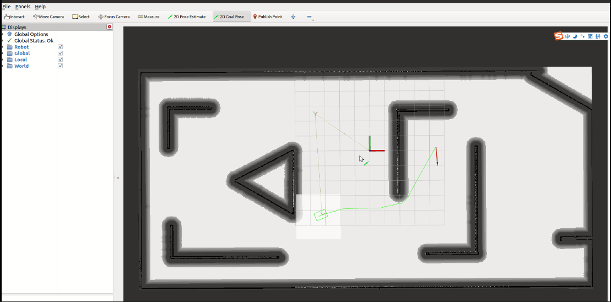

# 一起动手写ROS仿真器

本仓库是《一起动手写ROS仿真器》系列教程的代码和示例集合。这个教程旨在帮助你从零开始，逐步添加功能，最终完整实现一个用于ROS平台**机器人导航规划控制功能**的ROS仿真器

## 简介
ROS（Robot Operating System）是一个广泛使用的机器人开发平台，提供了一系列工具和库，用于构建机器人应用程序。在本教程中，我们将使用ROS来开发一个仿真器，模拟机器人在虚拟环境中的运动和感知。
fdasdf
## 教程目录

[一起动手写ROS仿真器](https://nav-simulator.readthedocs.io/en/latest/)

## 安装依赖
在开始教程之前，请确保教程所使用的环境：

操作系统：  Ubuntu 20.04

ROS:&nbsp;&nbsp;&nbsp;&nbsp; galactic

## 使用方法
ToDo

## 贡献
欢迎对本教程提出问题、反馈和改进建议。如果您发现任何错误或问题，请随时提交Issue或Pull Request。

## 许可证
本教程的代码遵循MIT许可证，详情请参见 LICENSE 文件。

---

*本教程旨在帮助大家学习ROS仿真器的构建，如果有任何侵权行为，请及时联系作者删除。谢谢！*

