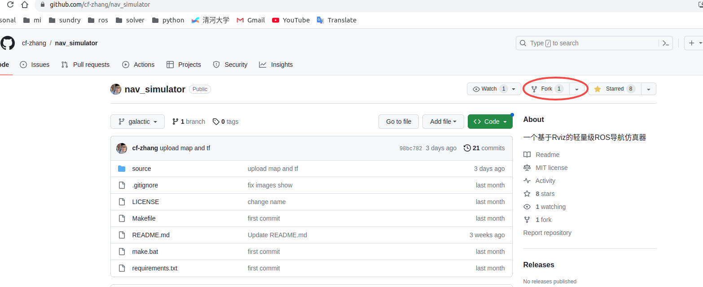
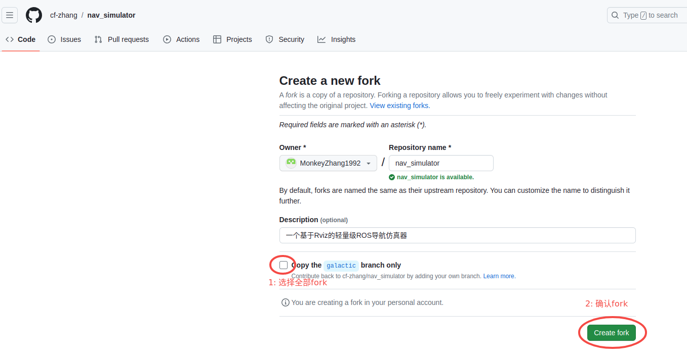
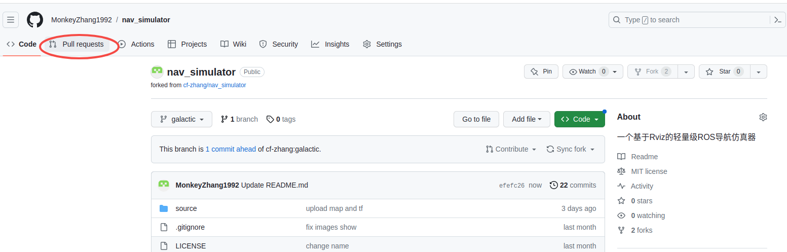
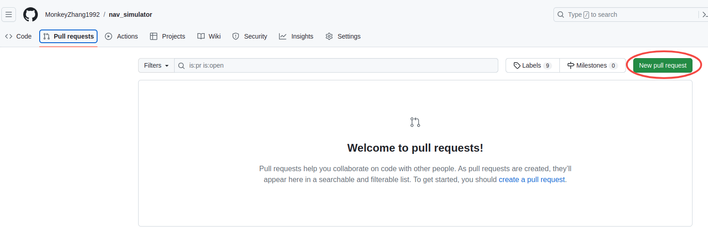
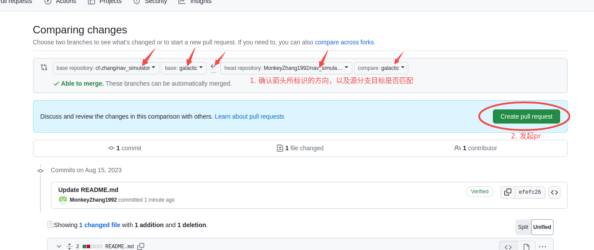

# Fork和Pull Request

在确定要参与到项目的情况下，请联系cf-zhang在本仓库中建立对应的ROS发布分支，然后按照如下的步骤参与进来。有任何问题，请及时在开发群里反馈沟通。

1. 在源仓库分支创建好之后，开发者首先Fork（复制）一个项目的仓库到自己的GitHub账号下。

    打开：  https://github.com/cf-zhang/nav_simulator

    
    

2. 在自己Fork的仓库的对应分支下进行修改和开发。

3. 当完成某个功能或修复时，可以发起Pull Request（PR）将自己的修改合并到原项目。

    打开自己github的nav_simulator地址,通过如下步骤完成pull request.

    
    
    

