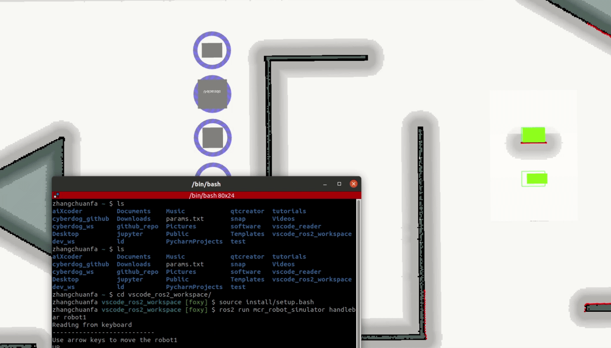
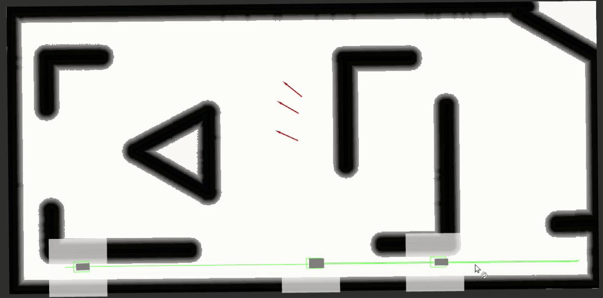
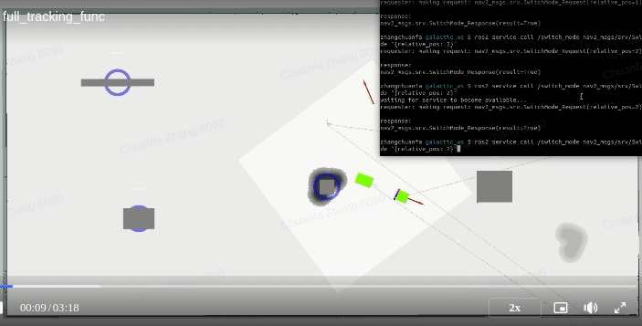

# 仿真器概述

## 引言

    文档通篇致力于实现一个简单高效的仿真工具，用于2D移动机器人的导航功能开发
                                    -----------    工欲善其事 必先利其器

在完成前面环境安装与开发环境搭建之后，正式进入仿真器阶段。在本小节，首先从仿真器到底在仿什么进行切入，尽可能的讲清楚即将实现的仿真器所拥有的模块，以及模块之间的关系。

## 什么是仿真器

仿真器： 一个通过计算机技术与建模技术所构建出来的虚拟的，可视化的，用于节约开发成本的工具。

解决机器人时间，地点，人物，事件的描述问题。

## 仿真器与实体机器人

主要通过机器人与仿真器之间的类比，来筛选出仿真器所需要的最小功能集合。

### 真实的机器人架构

### 导航算法功能架构

## Nav Simulator

导航算法的仿真的最小模块集合：

- 虚拟时钟
        
在ROS2中，如果你的节点需要使用仿真时间来与其他节点同步，你可以将 use_sim_time 参数设置为 true。这样，节点会订阅 /clock 话题，并使用从该话题接收到的时间信息，而不是从系统时钟获取时间。这使得在仿真器中进行节点通信更加准确，因为所有节点都将使用仿真器提供的统一时间。
- 地图
        
作为仿真器的机器人运行环境，在导航算法中，并不知道建筑物的概念，输入就只是地图，所以，只要有一张地图就可以满足规划需求。

- 坐标系

描述机器人与地图之间的坐标变换， 允许机器人系统中的不同组件在不同坐标系之间进行无缝的转换，以实现正确的坐标变换和传递。机器人通常由多个部件组成，例如传感器、执行器、末端执行器等，它们在不同的坐标系中工作。这些坐标系之间的关系可能是固定的，也可能是动态的。在导航功能里最小集合只需要map-->base_link之间的变化关系，中间还会插入一个odom坐标系用以位姿调整。ROS中提供了一个专用工具集：tf/tf2

- 机器人

用来直观的体现导航功能的效果,需要把base_link所在位姿，理解成是机器人的位姿，并进行可视化处理。

- 遥控器

用于自验证的工具

- 里程计

里程计（odometry）是一种通过测量机器人的轮子旋转和移动距离来估计机器人的运动的技术。它是一种基于机器人轮子运动的相对定位方法，用于跟踪机器人在一个相对于起始位置的局部坐标系中的运动。里程计通常在机器人的局部区域内提供较为准确的位姿估计，但随着时间的推移，累积误差可能会导致精度下降。
在做定位矫正的时候，实际就是调整的odom与map之间的关系。

- 传感器

用来感知障碍物，在机器人系统中，传感器是非常重要的组成部分，它们帮助机器人感知和理解周围环境。在仿真器的实现过程中，重点是如何将障碍物体现为传感器的数据形式。只以激光数据进行实现

- 障碍物

用来做导航算法的避障效果测试，可以分为永久障碍与临时障碍，临时障碍又分为静态障碍和动态障碍物。在仿真器的实现过程中，重点是如何将障碍物与地图关系进行映射，并将映射后的数据交给传感器仿真器进行数据呈现。

- 目标检测

用来做跟随功能，将多机器人仿真系统里的机器人A位姿输出，作为跟随机器人的目标进行跟踪。用于验证跟随算法效果。

- 可视化

直观的感受导航效果，路径，代价图，控制轨迹，速度曲线等等。实现鼠标拖拽，方便快捷的重定位效果。

## ROS 仿真器的使用场景

通过上面所描述的仿真系统，后续可以完成如下的基础功能：
### 遥控器

### 路径规划

### 机器人导航仿真

## ROS 仿真器的进阶功能
结合ros中的命名空间设计，可以完成进阶的功能仿真：
### 多机器人导航仿真

### 机器人跟随

## 总结

概述仿真器在机器人ROS开发中的重要性和应用。并将仿真器的最小功能集进行筛选解释，后续会逐步实现每个模块，最终组合成一个完整的导航仿真系统。