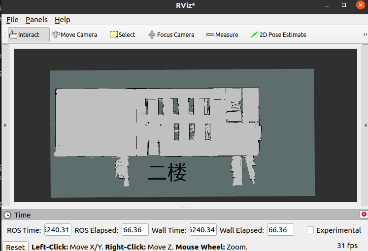

# 地图

作为仿真器的机器人运行环境，在导航算法中，并不知道建筑物的概念，输入就只是地图，所以，只要有一张地图就可以满足规划需求。

## nav2_map_server

## map

map一般是通过建图工具进行生成，也可以通过绘图软件进行编辑。不管从哪里来的地图，我们关心的只有如何将地图加载并管理起来。

### 数据形式：

在ROS中，常用的地图数据表示方式是栅格地图，其中环境被划分为许多小的栅格（grid cell）。每个栅格可以表示一个小区域，记录有关该区域的信息，通常是关于是否为障碍物、自由空间或未知区域的信息。这种表示方法适用于静态环境，可以被导航系统用于路径规划和避障。提供该地图的方式为：一个图片文件代表地图（一般为png文件或者pgm文件），一个yaml配置文件说明地图关键参数。

### 参数配置

yaml文件中相关参数及含义如下：
```
image: /path/to/map_image.png
resolution: 0.05
origin: [-10.0, -10.0, 0.0]
negate: 0
occupied_thresh: 0.65
free_thresh: 0.196
```
- image： 指定地图图像文件的路径，通常是PNG格式的栅格地图图像。
- resolution： 指定每个栅格的物理尺寸。
- origin： 定义地图原点在物理空间中的位置。
- negate： 如果设置为1，表示将栅格地图中的障碍物和自由空间取反。
- occupied_thresh： 定义被视为障碍物的栅格状态阈值。
- free_thresh： 定义被视为空闲区域的栅格状态阈值。

### 地图文件
项目提供两个地图放在`nav_simulator/src/simulator/`目录下maps目录中,后续的项目展开都会基于该地图进行。
```
.
├── CMakeLists.txt
├── include
│   └── simulator
├── maps
│   ├── a.pgm
│   ├── a.yaml
│   ├── b.pgm
│   └── b.yaml
├── package.xml
└── src
    ├── clock_node.cpp
    └── telecontrol.cpp

4 directories, 8 files
```
此时，还需要修改CMakeList.txt，增加如下install条目，使得maps文件夹移动到编译产物目录下，方便后期的debian文件制作以及ros2相关启动命令进行文件索引：
```
...
install(
    DIRECTORY maps
    DESTINATION share/${PROJECT_NAME}
)
...
```


## map server
在ROS 2（Robot Operating System 2）中，nav2_map_server 是与导航和路径规划相关的一个包。它负责管理和提供地图数据，以供ROS 2导航堆栈（Navigation Stack）中的其他节点使用。以下是关于nav2_map_server的概念、介绍和使用方法的详细信息：

nav2_map_server 是ROS 2中的一个节点，用于加载、管理和发布地图数据。在移动机器人的导航任务中，地图是一个关键的组成部分，它描述了机器人所在环境的空间布局。地图通常以栅格地图（Grid Map）的形式表示，其中每个栅格代表一小块区域，并标识出障碍物、自由空间等信息。

nav2_map_server节点的主要功能包括：

- 加载地图： 它可以从文件系统中加载保存的地图文件，如图片格式的地图或地图元数据文件。

- 管理地图数据： 一旦地图加载到节点中，nav2_map_server可以将其存储在内存中，以供其他导航节点查询和使用。

- 发布地图数据： 通过ROS 2的地图数据消息，如nav_msgs/OccupancyGrid消息类型，nav2_map_server将地图数据发布到ROS 2网络中，以便导航堆栈中的其他节点（如路径规划器、感知节点等）使用。

使用方法：

- 安装和配置： 首先，确保您已经安装了ROS 2以及nav2_map_server包。您可能需要在ROS 2工作空间中构建该包（前面navigation2的安装就已经完成了该步骤）。

- 准备地图数据： 获取或创建您的地图数据。这可以是一个图片格式的栅格地图，或者其他适用的地图数据文件（会提供map相关文件到项目的map文件夹）。

- 启动nav2_map_server节点： 在终端中执行命令以启动nav2_map_server节点，指定地图文件的路径和相关参数：

```
ros2 run nav2_map_server map_server --ros-args -p yaml_filename:=/path/to/your/map.yaml
```
其中/path/to/your/map.yaml是您地图的元数据文件的路径。
由于navigation2中的map_server是一个lifecycle node，所以需要执行生命周期的操作。另起一个terminal：
```
ros2 lifecycle set /map_server configure
ros2 lifecycle set /map_server activate
```

- 订阅地图数据： 在导航堆栈的其他节点（一般指costmap2D），您可以通过订阅nav_msgs/OccupancyGrid消息来获取地图数据，然后用于路径规划、感知等任务。
```
ros2 topic echo --qos-durability transient_local --qos-reliability reliable  /map
```
通过以上命令，可以接收到地图数据，或者打开rviz2进行可视化验证，订阅map组件能看到如下正常的地图，就说明功能一切正常，可以继续向下进行。


需要注意的是，nav2_map_server只是导航系统的一部分，用于提供地图数据。要实现完整的导航功能，您还需要使用其他导航堆栈的节点，如路径规划器、控制器等，以及适配您的机器人硬件和环境。

请参阅ROS 2文档和nav2_map_server包的官方文档以获取更详细的信息、配置选项和使用示例：[map server](https://navigation.ros.org/configuration/packages/configuring-map-server.html)

相关源码部分可以参考 [code](https://github.com/ros-planning/navigation2/tree/galactic/nav2_map_server)
