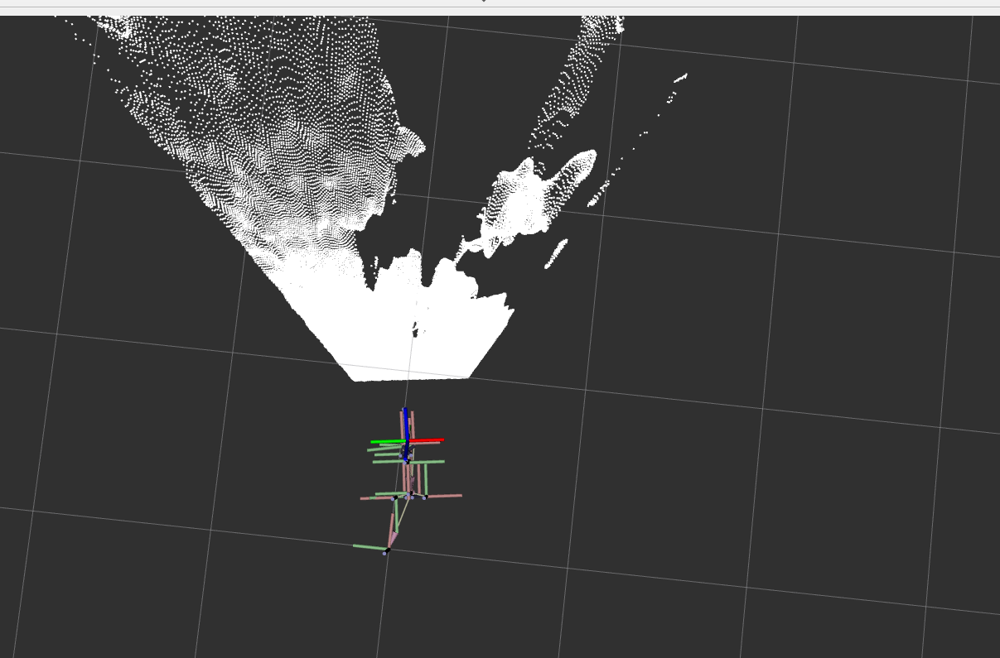
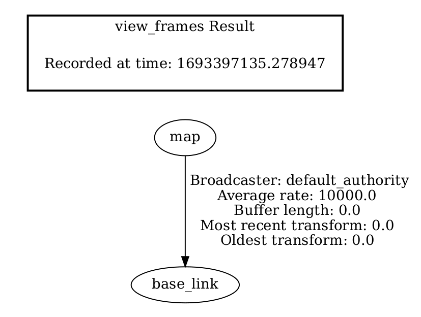

# 坐标系

## tf的介绍
在ROS（Robot Operating System）中，tf（Transform Library）是一个非常重要的工具，用于处理机器人坐标系之间的变换关系。它能够追踪和管理不同坐标系之间的变换关系，从而使得多个传感器和执行器的数据能够在统一的坐标系下进行协同处理和分析。以下是 tf 的功能和作用的概述：


### 功能：

坐标变换管理： tf 允许您在机器人系统中定义多个坐标系，然后跟踪和管理它们之间的变换关系。这些坐标系可以是车辆坐标系、传感器坐标系、全局地图坐标系等。

坐标变换广播： 通过 tf，您可以广播机器人各个坐标系之间的变换关系，使其他节点能够获取这些变换信息并进行数据转换。

坐标变换查询： tf 允许节点查询特定坐标系之间的变换关系，从而使数据在不同坐标系之间进行变换。这在传感器融合、导航和控制等任务中非常有用。

插值和平滑： tf 能够进行坐标变换的插值和平滑操作，使得坐标变换在连续时间范围内变得平滑，从而减少传感器噪声和不稳定性的影响。

### 作用：

传感器融合： 在机器人系统中，传感器通常会以不同的坐标系提供数据。tf 可以将这些数据转换到统一的坐标系下，以进行多传感器数据融合。

导航： 机器人的导航任务通常需要在全局坐标系和本地坐标系之间进行数据变换。tf 可以帮助实现这种变换，使机器人能够在不同坐标系下进行导航。

控制： 在执行器控制中，可能需要将控制指令从一个坐标系变换到另一个坐标系。tf 可以帮助进行这种变换，使控制指令适用于实际执行器所在的坐标系。

建图： 在进行SLAM（Simultaneous Localization and Mapping）建图时，不同传感器提供的数据需要在地图坐标系下进行处理。tf 可以实现这种数据变换，使数据能够在地图坐标系下正确对齐。

tf 在ROS中的作用非常重要，它使机器人系统能够处理不同坐标系之间的数据变换，从而实现多传感器数据融合、导航、控制和建图等任务。通过 tf，机器人系统可以更加灵活和强大地处理多坐标系数据。

## tf的初步使用
描述机器人与地图之间的坐标变换， 允许机器人系统中的不同组件在不同坐标系之间进行无缝的转换，以实现正确的坐标变换和传递。机器人通常由多个部件组成，例如传感器、执行器、末端执行器等，它们在不同的坐标系中工作。这些坐标系之间的关系可能是固定的，也可能是动态的。在这里，我们暂时先试用导航功能里最小集合：map-->base_link之间的变化关系。

ROS中提供了一个专用工具集：[tf](https://github.com/ros/geometry) / [tf2](https://github.com/ros2/geometry2)
同时也提供了一系列的tf工具。
我们先构建一个map->base_link的坐标关系，有了这个坐标关系，我们后续就可以进行机器人路径规划相关的算法开发了。
打开一个terminal，然后执行如下命令可以发布一个map->base_link的静态tf关系：
```
ros2 run tf2_ros static_transform_publisher 0 0 0 0 0 0 map base_link
```
然后打开另一个terminal，执行如下命令，可以将当前系统中的tf关系可视化出来。
```
ros2 run tf2_tools view_frames
```
这条命令会在当前目录生成两个文件：`frames.gv` `frames.pdf` 实际上属于同一个内容的不同表达形式，此时打开pdf文件可以看到如下内容：

