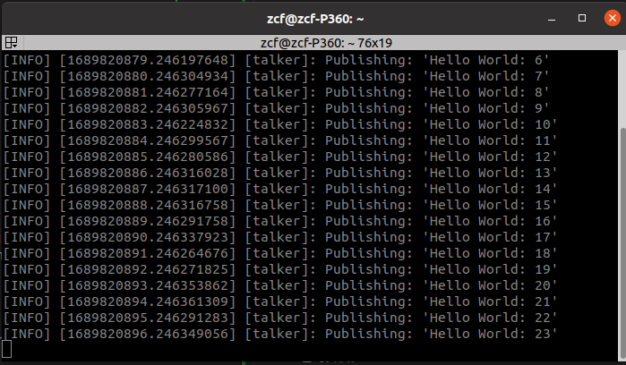
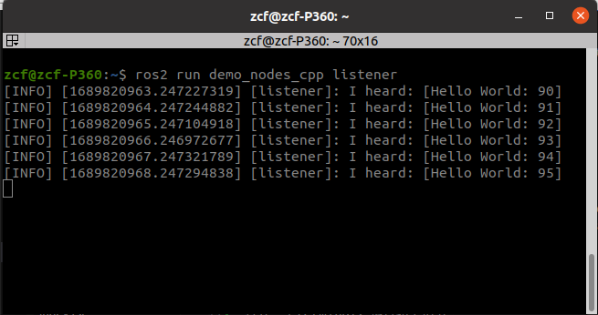

# 环境安装


## 引言

&nbsp;&nbsp;&nbsp;&nbsp;为了帮助读者快速开始使用ROS，并确保他们在正确的环境中配置和安装ROS系统与书中所使用的环境保持一致。在这一小节对ROS环境安装以及navigation2的安装进行学习。

&nbsp;&nbsp;&nbsp;&nbsp;将环境安装单独安排一个章节进行描述，可以帮助零基础读者迅速了解ROS的安装流程和基本要求。对于有相关基础的环境的读者可以在不浪费时间的情况下快速调到下一个章节，了解ROS系统的基本结构和功能。

&nbsp;&nbsp;&nbsp;&nbsp;ROS的安装和配置可能涉及多个步骤和依赖项。通过提供详细的安装指导，确保读者能够正确配置ROS环境，避免因配置错误而导致的问题和不必要的麻烦。

&nbsp;&nbsp;&nbsp;&nbsp;本小节的内容主要来自ROS2的Wiki，以及navigation2的wiki。会在下方贴出相关站点链接，英文功底扎实的同学可以直接前往官方文档进行安装后，跳过本小节。

均建议使用二进制安装包进行环境配置：

```
ROS2（galactic）：   https://docs.ros.org/en/galactic/Installation/Ubuntu-Install-Debians.html

navigation2（galactic）：    https://navigation.ros.org/getting_started/index.html#installation
```

## 操作系统和ROS版本

&nbsp;&nbsp;&nbsp;&nbsp;书中使用的操作系统为 ubuntu 20.04

&nbsp;&nbsp;&nbsp;&nbsp;ROS2版本为galactic

&nbsp;&nbsp;&nbsp;&nbsp;尽量避免虚拟机的形式安装ubuntu，可以考虑安装双系统。或者直接安排ubuntu系统在开发的PC上。(具体双系统怎么装，就不在此罗列了)

&nbsp;&nbsp;&nbsp;&nbsp;安装顺序是先安装完成ROS，再进行navigation2的功能包安装。

## 安装ROS

详细介绍在所选操作系统上安装ROS的步骤。
包括添加ROS软件源、使用包管理器安装ROS核心软件包、设置ROS环境变量等。

### 设置语言环境

```
locale  # check for UTF-8

sudo apt update && sudo apt install locales
sudo locale-gen en_US en_US.UTF-8
sudo update-locale LC_ALL=en_US.UTF-8 LANG=en_US.UTF-8
export LANG=en_US.UTF-8

locale  # verify settings
```

### 设置软件源

将apt软件仓库添加到系统中
```
sudo apt install software-properties-common
sudo add-apt-repository universe
```

添加 ROS2的GPG密钥
```
sudo apt update && sudo apt install curl
sudo curl -sSL https://raw.githubusercontent.com/ros/rosdistro/master/ros.key -o /usr/share/keyrings/ros-archive-keyring.gpg
```

然后将软件源添加到系统源列表中
```
echo "deb [arch=$(dpkg --print-architecture) signed-by=/usr/share/keyrings/ros-archive-keyring.gpg] http://packages.ros.org/ros2/ubuntu $(. /etc/os-release && echo $UBUNTU_CODENAME) main" | sudo tee /etc/apt/sources.list.d/ros2.list > /dev/null
```

### 安装ROS2的功能包

完成软件源设置之后更新apt仓库的缓存
```
sudo apt update
```

检查已安装软件包的更新，并将可用的更新版本下载并安装到系统中
```
sudo apt upgrade
```

推荐安装Desktop版本，其包括了一系列可视化工具和示例程序
```
sudo apt install ros-galactic-desktop
```
安装开发工具：编译器和其他构建ROS包的工具
```
sudo apt install ros-dev-tools
```

### 设置环境变量
安装位置一般会位于/opt/ros/galactic/目录
```
# Replace ".bash" with your shell if you're not using bash
# Possible values are: setup.bash, setup.sh, setup.zsh
source /opt/ros/galactic/setup.bash
```

### ROS2环境验证
打开一个terminal，运行如下指令：
```
source /opt/ros/galactic/setup.bash
ros2 run demo_nodes_cpp talker
```


打开另一个terminal，运行如下指令：
```
source /opt/ros/galactic/setup.bash
ros2 run demo_nodes_py listener
```


&nbsp;&nbsp;&nbsp;&nbsp;如果两个终端的指令执行和输出显示均如图所示，那么说明ROS2的环境已经安装OK，可以进行下一步的navigation2功能包的安装。

### ROS2卸载
&nbsp;&nbsp;&nbsp;&nbsp;如果决定退坑不玩儿了，可以选择保留环境或者卸载环境，卸载时按照如下指令执行即可。
卸载ROS2相关软件包
```
sudo apt remove ~nros-galactic-* && sudo apt autoremove
```
删除ROS2相关的软件源
```
sudo rm /etc/apt/sources.list.d/ros2.list
sudo apt update
sudo apt autoremove
# Consider upgrading for packages previously shadowed.
sudo apt upgrade
```

## 安装navigation2

&nbsp;&nbsp;&nbsp;&nbsp;在保证ROS2环境安装并配置成功之后，就可以进行navigation2的功能包安装了。

### 安装
安装Nav2相关的功能包
```
sudo apt install ros-galactic-navigation2
sudo apt install ros-galactic-nav2-bringup
```

安装Turtlebot3仿真包
```
sudo apt install ros-galactic-turtlebot3-gazebo
```

### 功能验证
打开一个terminal，执行如下指令设置所需要的环境变量
```
source /opt/ros/galactic/setup.bash
export TURTLEBOT3_MODEL=waffle
export GAZEBO_MODEL_PATH=$GAZEBO_MODEL_PATH:/opt/ros/galactic/share/turtlebot3_gazebo/models
```

然后执行如下指令
```
ros2 launch nav2_bringup tb3_simulation_launch.py headless:=False
```

如果能看到如下效果图，那么说明navigation2的功能包安装成功。


&nbsp;&nbsp;&nbsp;&nbsp;第一次启动功能，可能会由于gazebo模型加载需要等的久一些。但是我们这本书就是要写一个替代gazebo的仿真器来进行导航功能验证，所以如果实在无法启动  只要前面安装过程都是顺利无报错的，也不影响后续内容的进行。

## 常见安装问题和解决方法
```
source /opt/ros/galactic/setup.bash
```
执行如上指令，是为了设置ROS2相关的环境变量。如果环境里只会用到刚安装的这一ROS版本，那么可以使用下面的指令，将该步骤写入到.bashrc中，避免每次启动终端都要先运行如上的source指令了。
```
echo  'source /opt/ros/galactic/setup.bash' >> ~/.bashrc 
```

&nbsp;&nbsp;&nbsp;&nbsp;在安装过程中，不可避免的会遇到一些奇奇怪怪的问题，要学会善于利用搜索工具，google或者baidu，还有ros社区等。

&nbsp;&nbsp;&nbsp;&nbsp;如果后续我建立沟通交流渠道的话，也可以在沟通群里寻求伙伴的帮助。

## 总结

&nbsp;&nbsp;&nbsp;&nbsp;成功安装和配置ROS环境和navigation2功能栈。

