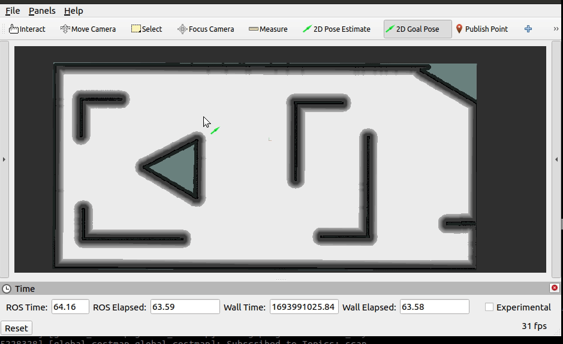

# 第一个全局路径规划器
文档翻译自： [Writing a New Planner Plugin](https://navigation.ros.org/plugin_tutorials/docs/writing_new_nav2planner_plugin.html)


## 概述
本教程介绍了如何创建自己的规划器插件（Planner Plugin）。

## 要求

- ROS 2（二进制或从源代码构建）
- Nav2（包括依赖项）

## 教程步骤

### 创建新的规划器插件

我们将创建一个简单的直线规划器（straight-line planner）。本教程中的代码示例可以在[nav_simulator](https://github.com/cf-zhang/nav_simulator)仓库中的planner找到。这个包可以被视为编写规划器插件的参考。

我们的示例插件继承自基类nav2_core::GlobalPlanner。基类提供了5个纯虚方法来实现规划器插件。规划器插件将被规划器服务器用于计算轨迹。让我们更详细地了解编写规划器插件所需的方法。

| 虚函数 | 函数描述 | 需要重写？ |
|---------|---------|---------|
| configure() | 当planner server进入on_configure状态时调用该方法。理想情况下，这个方法应该执行ROS参数的声明和规划器成员变量的初始化。该方法接受4个输入参数：父节点的共享指针，规划器名称，tf缓冲区的指针以及代价地图的共享指针。 | 是 |
| activate() | 当planner_server进入on_activate状态时调用该方法。理想情况下，这个方法应该实现规划器进入活动状态前必要的操作。 | 是 |
| deactivate() | 当planner server进入on_deactivate状态时调用该方法。理想情况下，这个方法应该实现规划器进入非活动状态前必要的操作。| 是 |
| cleanup() | 当planner server进入on_cleanup状态时调用该方法。理想情况下，这个方法应该清理为规划器创建的资源。| 是 |
| createPlan() | 当planner server需要为指定的起始姿态和目标姿态生成全局规划时调用该方法。该方法返回携带全局规划的nav_msgs::msg::Path。该方法接受2个输入参数：起始姿态和目标姿态。| 是 |

对于本教程，我们将使用方法`StraightLine::configure()`和`StraightLine::createPlan()`来创建直线规划器。

在规划器中，configure()方法必须从ROS参数中设置成员变量并进行任何所需的初始化。

```
node_ = parent;
tf_ = tf;
name_ = name;
costmap_ = costmap_ros->getCostmap();
global_frame_ = costmap_ros->getGlobalFrameID();

// Parameter initialization
nav2_util::declare_parameter_if_not_declared(node_, name_ + ".interpolation_resolution", rclcpp::ParameterValue(0.1));
node_->get_parameter(name_ + ".interpolation_resolution", interpolation_resolution_);
```

在这里，name_ + ".interpolation_resolution" 获取了与我们的规划器特定的ROS参数`interpolation_resolution`。Nav2允许加载多个插件，并为了保持组织结构的清晰，每个插件都映射到某个ID或名称。现在，如果我们想要检索特定插件的参数，我们使用<mapped_name_of_plugin>.<name_of_parameter>，就像上面的代码片段中所做的那样。例如，我们的示例规划器映射到名称"GridBased"，要检索特定于"GridBased"的`interpolation_resolution`参数，我们使用GridBased.interpolation_resolution。换句话说，GridBased被用作插件特定参数的命名空间。当我们讨论参数文件（或参数文件）时，我们将更多地了解这一点。

在`createPlan()`方法中，我们需要根据给定的起始姿态和目标姿态创建一条路径。`StraightLine::createPlan()`被调用，使用起始姿态和目标姿态来解决全局路径规划问题。成功后，它将路径转换为`nav_msgs::msg::Path`并返回给规划器服务器。下面的注释显示了这个方法的实现。

```
nav_msgs::msg::Path global_path;

// Checking if the goal and start state is in the global frame
if (start.header.frame_id != global_frame_) {
  RCLCPP_ERROR(
    node_->get_logger(), "Planner will only except start position from %s frame",
    global_frame_.c_str());
  return global_path;
}

if (goal.header.frame_id != global_frame_) {
  RCLCPP_INFO(
    node_->get_logger(), "Planner will only except goal position from %s frame",
    global_frame_.c_str());
  return global_path;
}

global_path.poses.clear();
global_path.header.stamp = node_->now();
global_path.header.frame_id = global_frame_;
// calculating the number of loops for current value of interpolation_resolution_
int total_number_of_loop = std::hypot(
  goal.pose.position.x - start.pose.position.x,
  goal.pose.position.y - start.pose.position.y) /
  interpolation_resolution_;
double x_increment = (goal.pose.position.x - start.pose.position.x) / total_number_of_loop;
double y_increment = (goal.pose.position.y - start.pose.position.y) / total_number_of_loop;

for (int i = 0; i < total_number_of_loop; ++i) {
  geometry_msgs::msg::PoseStamped pose;
  pose.pose.position.x = start.pose.position.x + x_increment * i;
  pose.pose.position.y = start.pose.position.y + y_increment * i;
  pose.pose.position.z = 0.0;
  pose.pose.orientation.x = 0.0;
  pose.pose.orientation.y = 0.0;
  pose.pose.orientation.z = 0.0;
  pose.pose.orientation.w = 1.0;
  pose.header.stamp = node_->now();
  pose.header.frame_id = global_frame_;
  global_path.poses.push_back(pose);
}

global_path.poses.push_back(goal);

return global_path;
```

剩下的方法虽然不被使用，但是必须覆盖它们。根据规则，我们确实覆盖了所有方法，只是将它们保留为空白。

### 导出规划器插件
现在我们已经创建了自定义规划器，我们需要导出我们的规划器插件，以便它对规划器服务器可见。插件在运行时加载，如果它们不可见，那么我们的规划器服务器将无法加载它们。在ROS 2中，插件的导出和加载由pluginlib处理。

回到我们的教程，类planner::StraightLine以nav2_core::GlobalPlanner的形式动态加载，这是我们的基类。

1. 要导出规划器，我们需要提供两行代码：
```
#include "pluginlib/class_list_macros.hpp"
PLUGINLIB_EXPORT_CLASS(planner::StraightLine, nav2_core::GlobalPlanner)
```

请注意，需要使用pluginlib来导出插件的类。Pluginlib将提供名为PLUGINLIB_EXPORT_CLASS的宏，它会执行导出的所有工作。

将这些行放在文件末尾是一种良好的做法，但在技术上，您也可以放在文件顶部。

2. 接下来，需要在包的根目录中创建插件的描述文件。例如，在我们的教程包中创建一个名为global_planner_plugin.xml的文件。该文件包含以下信息：

- `library path`：插件的库名称及其位置。

- `class name`：类的名称。

- `class type`：类的类型。

- `base class`：基类的名称。

- `description`：插件的描述。

```
<library path="planners">
  <class name="planner/StraightLine" type="planner::StraightLine" base_class_type="nav2_core::GlobalPlanner">
    <description>This is an example plugin which produces straight path.</description>
  </class>
</library>
```

3. 下一步是使用CMakeLists.txt导出插件，使用cmake函数pluginlib_export_plugin_description_file()。此函数将插件描述文件安装到share目录，并设置ament索引以使其可发现。
```
pluginlib_export_plugin_description_file(nav2_core planner_plugins.xml)
```

4. 插件描述文件也应该添加到package.xml文件中。

```
<export>
  <build_type>ament_cmake</build_type>
  <nav2_core plugin="${prefix}/planner_plugins.xml" />
</export>
```
5. 编译并应该注册。接下来，我们将使用这个插件。

### 通过params文件传递插件名称
要启用插件，我们需要修改planner.yaml文件，以替换以下参数。

    注意

    对于Galactic或更高版本，plugin_names和plugin_types已被替换为插件名称的单个plugins字符串向量。类型现在在plugin_name命名空间中在plugin:字段中定义（例如，plugin: MyPlugin::Plugin）。代码块中的内联注释将帮助您完成此操作。

```
planner_server:
  ros__parameters:
    plugins: ["GridBased"]
    use_sim_time: True
    GridBased:
      plugin: "nav2_navfn_planner/NavfnPlanner" # For Foxy and later
      tolerance: 2.0
      use_astar: false
      allow_unknown: true
```
替换为
```
planner_server:
  ros__parameters:
    plugins: ["GridBased", "straight"]
    use_sim_time: True
    GridBased:
      plugin: "nav2_navfn_planner/NavfnPlanner" # For Foxy and later
      tolerance: 2.0
      use_astar: false
      allow_unknown: true

    straight:
      plugin: "planner/StraightLine"
      interpolation_resolution: 0.1
```

在上面的代码片段中，您可以观察 planner/StraightLine planner 到其 id GridBased 的映射。为了传递特定于插件的参数，我们使用了 <plugin_id>.<plugin_specific_parameter>。

由于planner server可以加载多个规划器，所以planner bridge中设计了一个`planner_id`参数，可以通过planner_bridge节点的`planner_id`来指定该次测试是使用`GridBased`还是使用`straight`规划器。

### 运行直线插件

按照上一小节《路径规划仿真二》中的描述进行路径规划效果的验证，可以有如下的效果展示：


