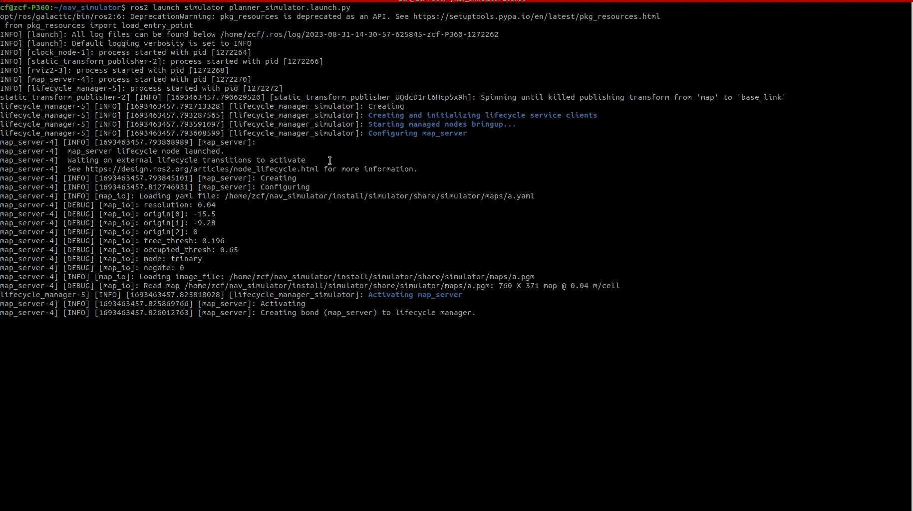

# launch

## 介绍
在ROS2中，`launch` 文件是用于管理和配置机器人系统中各种节点（ROS2程序）以及它们之间的关系的一种XML格式的配置文件。`launch` 文件允许您在一个地方定义和组织多个节点的启动、参数、命名空间、参数设置、命令行参数等，以便更方便地启动和管理整个机器人系统。

以下是关于ROS2中`launch`文件的一些重要概念和作用：

- **组织节点启动：** 
    通过`launch`文件，您可以同时启动多个ROS 2节点，这些节点可以是传感器、执行器、算法、控制器等等。这使得整个系统的启动和管理变得更加方便。

- **参数设置和配置：**
    使用`launch`文件，您可以为每个节点设置参数和配置，以便在启动时提供定制化的设置。这使得节点的配置和参数管理变得更加集中和容易。

- **命名空间管理：** 
    `launch`文件允许您为每个节点设置命名空间，从而在启动时为节点提供独立的命名空间环境，防止节点之间的冲突。

- **启动顺序和依赖：** 
    通过`launch`文件，您可以指定节点的启动顺序以及节点之间的依赖关系。这对于确保节点在正确的顺序启动以及正确处理依赖关系非常重要。

- **可读性和可维护性：** 
    使用`launch`文件可以将节点的配置和启动参数集中在一个地方，使得系统的配置更加可读性和可维护性。

- **条件启动：** 
    `launch`文件还支持根据条件来启动特定的节点或一组节点，这在根据环境或任务需要灵活地调整系统行为时非常有用。

- **可重用性：** 
    您可以将`launch`文件设计为可重用的模块，以便在不同的机器人系统中使用相似的配置。

- **启动参数传递：** 
    使用`launch`文件，您可以将参数传递给节点，以便在启动时动态地配置节点的行为。

想了解更详细的内容，可以追本溯源： [Wiki](https://docs.ros.org/en/galactic/Tutorials/Intermediate/Launch/Launch-Main.html)


## 仿真器的第一个启动脚本
在完成了地图的加载与map->base_link的tf关系发布之后，此时的系统状态就已经满足了机器人导航中的路径规划算法运行的条件，但是如果每次都手动启动各个节点，再进行算法验证，略显繁琐。尤其是当项目逐渐扩大之后，启动一次算法验证，要打开许多个终端界面，会让人崩溃。所以我们需要将所有依赖的节点都通过一个启动脚本文件进行管理，当需要做功能验证的时候，只需要一个命令就可以完成所有依赖加载。

接下来，
- 在`nav_simulator/src/simulator`目录下创建`launch`文件夹，并创建一个`planner_simulator.launch.py`文件
- 在`nav_simulator/src/simulator`目录下创建`rviz`文件夹，用于保存rviz的配置文件
然后将map_server、tf以及rviz都依次添加到脚本中，完成本小节内容之后，就具备了机器人导航路径开发的所有条件。

此时，还需要修改CMakeList.txt，修改如下install条目，使得`launch`文件夹移动到编译产物目录下，方便后期的debian文件制作以及ros2相关启动命令进行文件索引：
```
...
install(
    DIRECTORY maps launch
    DESTINATION share/${PROJECT_NAME}
)
...
```
这里navigation2中引入了一个lifecycle的概念，lifecycle manager 负责管理 lifecycle node。用于管理节点进程的声明周期： configure， activate， deactivate， cleanup等。

下面以注释的形式，对planner_simulator.launch.py文件内容进行解释
```
import os
from launch import LaunchDescription
from launch_ros.actions import Node
from ament_index_python.packages import get_package_share_directory

def generate_launch_description():
    # 获取当前package的目录，并以此得到地图文件的文件名
    package_dir = get_package_share_directory('simulator')
    yaml_filename = os.path.join(package_dir, 'maps', 'a.yaml')
    # 设置rviz的加载配置文件位置
    rviz_config = os.path.join(package_dir, 'rviz', 'planner.rviz')
    # 设置需要被lifecycle manager管理的lifecycle node
    lifecycle_nodes = ['map_server']
    return LaunchDescription([
        # 启动仿真时间节点，在/clock话题中发布时钟
        Node(
           package='simulator',
           executable='clock_node',
           name='clock',
           output='screen'
           ),
        # 发布一个静态的坐标变换关系，用于描述map->base_link
        Node(
           package='tf2_ros',
           executable='static_transform_publisher',
           parameters=[{'use_sim_time': True}],
           arguments=['0', '0', '0', '0', '0', '0', 'map', 'base_link']),
        # 打开一个用于显示的rviz2终端
        Node(
            package='rviz2',
            executable='rviz2',
            name='rviz2',
            arguments=['-d', rviz_config],
            parameters=[{'use_sim_time': True}],
            ),
        # 启动map_server并加载上面变量中的map文件
        Node(
            package='nav2_map_server',
            executable='map_server',
            name='map_server',
            output='screen',
            parameters=[{'yaml_filename': yaml_filename},
                        {'use_sim_time': True}]),
        # 启动lifecycle manager节点，用于管理map_server的生命周期
        Node(
            package='nav2_lifecycle_manager',
            executable='lifecycle_manager',
            name='lifecycle_manager_simulator',
            output='screen',
            parameters=[{'use_sim_time': True},
                        {'autostart': True},
                        {'node_names': lifecycle_nodes}])
    ])
```

到这里，就具备了ROS机器人导航中路径规划的全部条件。

