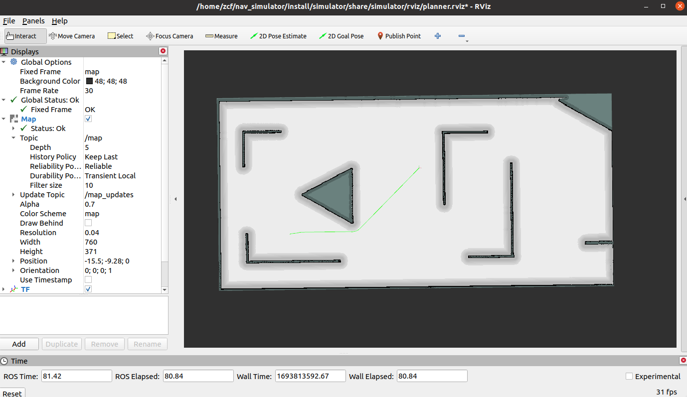
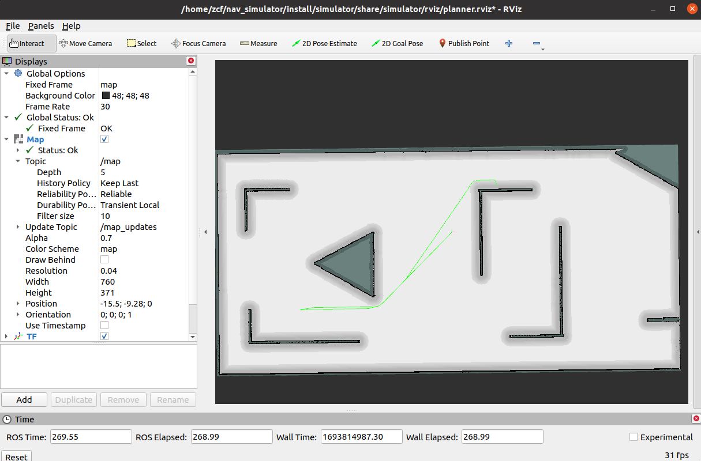

# 全局路径规划仿真一

为了完成全局路径规划的仿真，我们需要加载`navigation2`中的`planner_server`节点，并为`planner_server`编写我们自己的路径规划器插件。

基于此，在`nav_simulator/src`目录下，新建一个`planner`的package，用于路径规划相关的功能介绍。


```
cd nav_simulator/src/
ros2 pkg create --build-type ament_cmake --library-name planners --dependencies nav2_core --maintainer-name zcf --maintainer-email xxxx@162.com planner
```

下面会介绍一下`planner server`，然后利用启动脚本将其加载到系统里， 后面一个小节还会提供一个路劲规划器的用例。

## Planner server的介绍



`nav2_planner`是`navigation2`中负责管理全局路径规划的主要模块，帮助机器人在不同环境中选择安全和高效的全局路径。下面关于`nav2_planner`的一些介绍：

- lifecycle node： `nav2_planner`设计为一个lifecycle节点，被lifecycle manager有效管理起来，可以最大程度上利用系统资源。

- 路径规划： `nav2_planner`主要任务就是管理规划器插件，并根据任务需求，选择指定插件完成路径规划任务。它决定了机器人如何从其当前位置到达目标位置，同时避免碰撞障碍物。

- 插件架构： `nav2_planner`的架构是可插拔的，这意味着您可以选择不同的路径规划算法和策略来满足您的需求。这种灵活性使得您可以根据不同的应用场景选择最适合的路径规划方法。

- compute_path_to_pose： 常规的A\B点之间的路径规划

- compute_path_through_poses： 用于多个途经点的路径规划

官方文档说明可参考：[planner wiki](https://navigation.ros.org/concepts/index.html#planners)
## planner server的使用

### 创建配置文件

在`planner`的根目录下,新建一个`params`目录用于参数文件, 并在该目录创建planner.yaml：

```
cd planner
mkdir params
touch planner.yaml
```

`planner.yaml`文件中存放`planner_server`相关的参数：

```
global_costmap:
  global_costmap:
    ros__parameters:
      update_frequency: 1.0
      publish_frequency: 1.0
      global_frame: map
      robot_base_frame: base_link
      use_sim_time: True
      robot_radius: 0.22
      resolution: 0.05
      track_unknown_space: true
      plugins: ["static_layer", "obstacle_layer", "inflation_layer"]
      obstacle_layer:
        plugin: "nav2_costmap_2d::ObstacleLayer"
        enabled: True
        observation_sources: scan
        scan:
          topic: /scan
          max_obstacle_height: 2.0
          clearing: True
          marking: True
          data_type: "LaserScan"
          raytrace_max_range: 3.0
          raytrace_min_range: 0.0
          obstacle_max_range: 2.5
          obstacle_min_range: 0.0
      static_layer:
        plugin: "nav2_costmap_2d::StaticLayer"
        map_subscribe_transient_local: True
      inflation_layer:
        plugin: "nav2_costmap_2d::InflationLayer"
        cost_scaling_factor: 3.0
        inflation_radius: 0.55
      always_send_full_costmap: True
  global_costmap_client:
    ros__parameters:
      use_sim_time: True
  global_costmap_rclcpp_node:
    ros__parameters:
      use_sim_time: True

planner_server:
  ros__parameters:
    expected_planner_frequency: 20.0
    use_sim_time: True
    planner_plugins: ["GridBased"]
    GridBased:
      plugin: "nav2_navfn_planner/NavfnPlanner"
      tolerance: 0.5
      use_astar: false
      allow_unknown: true

planner_server_rclcpp_node:
  ros__parameters:
    use_sim_time: True
```

更多planner server配置相关的详细内容可以参考：[Planner Server](https://navigation.ros.org/configuration/packages/configuring-planner-server.html)

### 创建启动脚本

在`planner`的根目录下,新建一个`launch`目录用于存放启动脚本, 并在该目录创建planner.launch.py：

```
cd planner
mkdir launch
touch planner.launch.py
```

按照如下内容编辑启动脚本：

```
import os

from ament_index_python.packages import get_package_share_directory

from launch import LaunchDescription
from launch.actions import DeclareLaunchArgument, SetEnvironmentVariable
from launch.substitutions import LaunchConfiguration
from launch_ros.actions import Node
from nav2_common.launch import RewrittenYaml


def generate_launch_description():
    # Get the launch directory
    package_dir = get_package_share_directory('planner')

    use_sim_time = LaunchConfiguration('use_sim_time')
    autostart = LaunchConfiguration('autostart')
    params_file = LaunchConfiguration('params_file')

    lifecycle_nodes = ['planner_server']


    # Create our own temporary YAML files that include substitutions
    param_substitutions = {
        'use_sim_time': use_sim_time,
        'autostart': autostart}

    configured_params = RewrittenYaml(
            source_file=params_file,
            root_key='',
            param_rewrites=param_substitutions,
            convert_types=True)

    return LaunchDescription([

        DeclareLaunchArgument(
            'use_sim_time', default_value='true',
            description='Use simulation (Gazebo) clock if true'),

        DeclareLaunchArgument(
            'autostart', default_value='true',
            description='Automatically startup the nav2 stack'),

        DeclareLaunchArgument(
            'params_file',
            default_value=os.path.join(planner, 'params', 'planner.yaml'),
            description='Full path to the ROS2 parameters file to use'),

        Node(
            package='nav2_planner',
            executable='planner_server',
            name='planner_server',
            output='screen',
            parameters=[configured_params],
            remappings=remappings),

        Node(
            package='nav2_lifecycle_manager',
            executable='lifecycle_manager',
            name='lifecycle_manager_navigation',
            output='screen',
            parameters=[{'use_sim_time': use_sim_time},
                        {'autostart': autostart},
                        {'node_names': lifecycle_nodes}]),
    ])
```

### 修改CMakeList并编译

并将上述两个文件夹，在`CMakeList.txt`进行`install`相关指令的处理，以便在启动加载时能够在安装目录中找到对应的文件。

```
install(
    DIRECTORY params launch
    DESTINATION share/${PROJECT_NAME}
)

```

在`nav_simulator`目录下执行编译指令：`colcon build`， 待编译完成后，可以启动两个终端（注意source）：

## 功能验证

第一个终端启动路径规划仿真器：
```
ros2 launch simulator planner_simulator.launch.py
```

另一个终端启动planner_server：
```
ros2 launch planner planner.launch.py
```

此时在rviz界面中加入相关的显示控件：`costmap2d`, `plan`等（设置完成后保存在simulator目录下的rviz目录中）。

然后执行如下的action请求，则可以看到如下的仿真结果。

### compute path to pose

- action msg
```
#goal definition
geometry_msgs/PoseStamped goal
geometry_msgs/PoseStamped start
string planner_id
bool use_start # If true, use current robot pose as path start, if false, use start above instead
---
#result definition
nav_msgs/Path path
builtin_interfaces/Duration planning_time
---
#feedback
```
- command
```
ros2 action send_goal /compute_path_to_pose nav2_msgs/action/ComputePathToPose "{use_start: true, planner_id: GridBased, start: {header: {frame_id: map}, pose: {position: {x: 0.0, y: 0.0}}}, goal: {header: {frame_id: map}, pose: {position: {x: -10.0, y: -5.0}}}}"
```



### compute path through poses

- action msg
```
#goal definition
geometry_msgs/PoseStamped[] goals
geometry_msgs/PoseStamped start
string planner_id
bool use_start # If true, use current robot pose as path start, if false, use start above instead
---
#result definition
nav_msgs/Path path
builtin_interfaces/Duration planning_time
---
#feedback

```

- command
```
ros2 action send_goal /compute_path_through_poses nav2_msgs/action/ComputePathThroughPoses "{use_start: true, planner_id: GridBased, start: {header: {frame_id: map}, pose: {position: {x: 0.0, y: 0.0}}}, goals: [{header: {frame_id: map}, pose: {position: {x: -10.0, y: -5.0}}}, {header: {frame_id: map}, pose: {position: {x: -3.0, y: -3.0}}},{header: {frame_id: map}, pose: {position: {x: 3.0, y: 3.0}}}]}"
```



当然，可以通过调整如上的goal和pose的坐标，以获得不同的路径规划结果。为了更高效的进行路径规划效果的验证，在接下来的一个小节会在`simulator`中实现一个订阅转发工具，用于使用rviz上的空间完成路径规划的任务下发。
