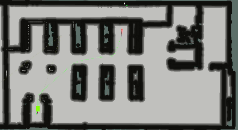
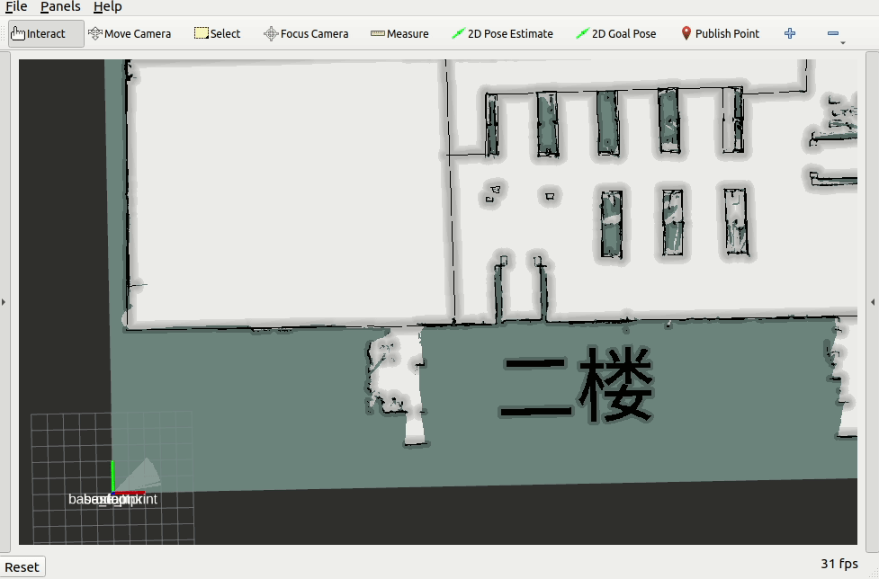
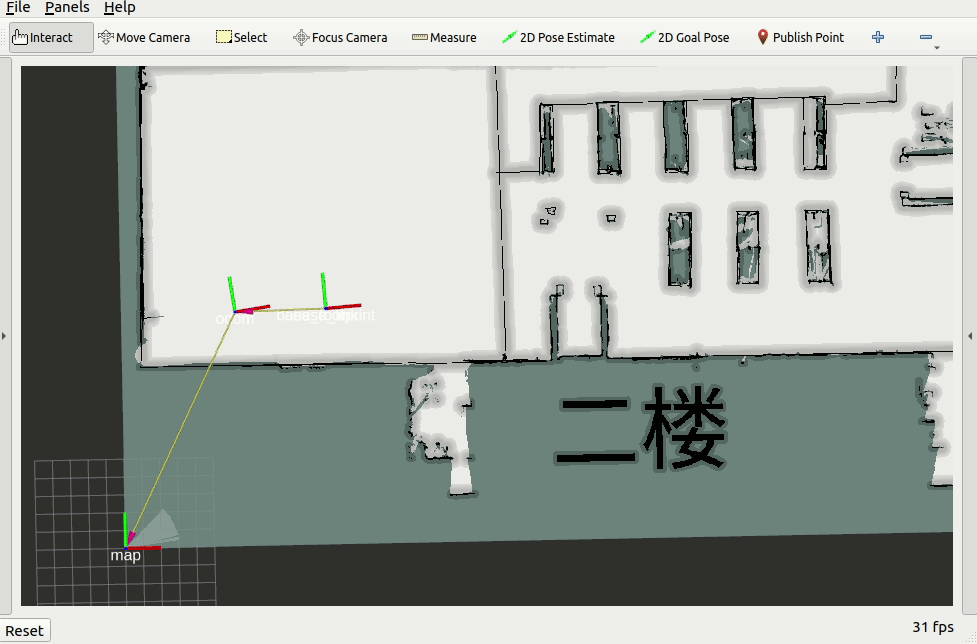

# 机器人的里程计概览



机器人的里程计是自主导航和定位的核心技术之一，高质量的里程计数据有助于提高机器人在各种环境中的导航性能。这方面的知识对于机器人工程师和研究人员来说都是非常重要的。

## 相关概念



如上图所示，从机器人出发的位置作为里程计坐标系，之后里程计的数据以此为参考点，进行累计。清晰的理解里程计坐标系与里程计数据的关系非常的重要。
在ROS系统里，里程计的数据定义如下：
nav_msgs/msg/Odometry
```
std_msgs/Header header
	builtin_interfaces/Time stamp
		int32 sec
		uint32 nanosec
	string frame_id
string child_frame_id

geometry_msgs/PoseWithCovariance pose
	Pose pose
		Point position
			float64 x
			float64 y
			float64 z
		Quaternion orientation
			float64 x 0
			float64 y 0
			float64 z 0
			float64 w 1
	float64[36] covariance

geometry_msgs/TwistWithCovariance twist
	Twist twist
		Vector3  linear
			float64 x
			float64 y
			float64 z
		Vector3  angular
			float64 x
			float64 y
			float64 z
	float64[36] covariance

```

在里程计数据中，covariance（协方差）是一种用于表示不确定性或误差的统计量。协方差矩阵通常用于描述测量值之间的关系，尤其是在机器人导航和定位中，它可以用来表示机器人位置和姿态的不确定性。

具体来说，里程计数据中的协方差矩阵通常包含了以下信息：

1. **位置误差**：协方差矩阵的对角线元素表示机器人位置（x、y、z坐标）的不确定性。较大的值表示更大的不确定性或误差，较小的值表示更小的不确定性。

2. **姿态误差**：协方差矩阵的非对角线元素通常表示机器人姿态（例如，方向或角度）之间的关联。这些元素告诉我们，一个方向的误差是否会影响其他方向。

3. **线性关系**：协方差矩阵还可以显示不同状态变量之间的线性关系。例如，如果x和y之间有正的协方差，这表示机器人在x方向上的误差可能会影响y方向上的误差，反之亦然。

4. **非线性关系**：在某些情况下，协方差矩阵还可以显示状态变量之间的非线性关系，尤其是在非线性系统中。

总之，协方差矩阵提供了关于里程计测量误差和不确定性的重要信息。这些信息对于机器人定位和导航非常关键，因为它们可以用来估计导航解决方案的可靠性，并帮助机器人在不确定性的环境中做出更准确的决策。

### 里程计坐标系


里程计坐标系是机器人中的一个关键概念，在机器人启动时，通常会将当前位置定义为起始点或原点。这个点的坐标通常被设置为(0, 0)，这是里程计坐标系的起点，机器人启动时的朝向定义为坐标系的x轴正方向，左侧为y轴正方向。该参考系的作用，就是来度量此后机器人所有的移动旋转等动作。

移动旋转等动作就是使用上面的里程计数据来描述的，里程计数据通常为定频输出，将每一个里程计数据进行累计描述，就可以实时的表述机器人从开机到当前时刻的运动轨迹。有时里程计的精度就是使用机器人按照一个闭环的场景进行运动，在机器人从原点出发后又回到出发原点时，里程计的统计误差情况来衡量的。

通常，在slam系统重，里程计坐标系会位于map与base_link之间，最后通过坐标系的变换解算来描述世界坐标系与机器人坐标系的关系。一般情况下，这个关系都是机器人导航算法所不感知的部分。

### 里程计

机器人的里程计（Odometry）是通过各种传感器测量技术，用于测量机器人在运动过程中相对于某个参考点的位置和方向变化的传感器或算法。通常，机器人里程计是通过测量轮子或其他运动部件的旋转来估计机器人的位姿（位置和方向）变化。它用于跟踪机器人在一个相对于起始位置的局部坐标系中的运动。里程计通常在机器人的局部区域内提供较为准确的位姿估计。然而，里程计存在误差和累积问题，因此在长时间运动后，位置估计可能会变得不准确。这个误差，一般包括轮子滑动、传感器精度、积分过程等都会造成累积。

常见的里程计基本都是和传感器绑定到一起的，从命名上就有很直观的体现：轮式里程计，腿式里程计，惯性里程计，视觉里程计，GPS里程计，激光里程计等等。


### 里程计融合
为了提高机器人的定位精度和鲁棒性，通常会将多种里程计数据进行融合，这个过程被称为里程计融合（Odometry Fusion）。里程计融合的目标是结合多个传感器源的信息，以获取更准确和可靠的机器人位姿估计。

融合算法负责将不同传感器源的信息融合在一起，以生成一组更准确的位姿估计。常见的融合算法包括卡尔曼滤波、扩展卡尔曼滤波（EKF）、粒子滤波等。

在融合过程中，需要建立每个传感器的误差模型，以便根据其相对可靠性对位姿估计进行加权。通过里程计融合，机器人可以在复杂环境中更准确地定位自己，从而支持自主导航、避障和任务执行。

机器人的里程计融合是提高机器人定位精度和鲁棒性的关键技术，它涉及传感器数据的融合和算法的优化，以确保机器人能够在复杂环境中准确导航和执行任务。

### 重定位


slam或者location在做定位矫正的时候，实际就是调整的odom与map之间的关系。而里程计由于其累计的特性，它的数据是不会变化的。

通过机器人运行过程中，对环境特征的提取对比来估计机器人的位姿变化，通过摄像头/雷达等传感器捕捉环境特征，并与先验的建图信息进行比对，当发现当前特征与建图特征有出入的时候，会调整里程计坐标系与世界坐标系的关系，来保证机器人人坐标系base_link的正确。

举个例子来讲这个过程： 


如上图所示，
- 数轴5米处有一个笑脸为已知建模，小明记得自己从前测量过自己的步长为1米，所以他从数轴0米处出发向前行走。
- 当他走了4步之后抵达了笑脸位置，这个时候他就很纳闷，明明才走了4步，怎么就到笑脸了呐？
- 冥思苦想之后，突然开窍，原来我不是从0米处出发的，我一定是从1米处出发的，所有走了4步就到了笑脸处了。
- 于是它把起始位置假象到1米处，，之后仍然按照步长1米进行统计。

假如后续还有很多个间隔5米的笑脸，那么，小明只需要不断地调整出发位置就可以同时满足自己的自定位情况和自我认知的需求了。
