# 里程计仿真的设计和实现

## 功能设计
上一个小节是表述的坐标在坐标系内的变换关系，下面两个图片分别映射了坐标系与坐标系之间的变换关系。

 | 
--- | ---

下图是里程计仿真模块的基本结构图，通过transform的处理，将输入与输出进行关联。

### 重新设计坐标系统

里程计仿真所输出的tf关系如下所示：

其中：

- map ---> odom 用来重定位
- odom ---> base_link 用来推演定位

### tf2_ros
`tf2_ros` 是 ROS 中用于处理变换（Transform）的库，它建立在 `tf2` 库之上，提供了 ROS 特定的功能。以下是 `tf2_ros` 主要接口和功能的罗列：

1. **`tf2_ros::Buffer` 类：**
   - **功能：** `Buffer` 类是 `tf2` 中的中心数据结构，用于存储和查询变换信息。
   - **主要接口：**
     - `lookupTransform(target_frame, source_frame, time)`：查询从 `source_frame` 到 `target_frame` 的变换。
     - `transformPoint(target_frame, stamped_in, target_frame, stamped_out)`：对一个点进行坐标变换。
     - `canTransform(target_frame, source_frame, time)`：检查是否能够查询给定时间点的变换。
     - `waitForTransform(target_frame, source_frame, time, timeout, polling_sleep_duration)`：等待直到能够查询到指定时间点的变换。

2. **`tf2_ros::TransformBroadcaster` 类：**
   - **功能：** `TransformBroadcaster` 类用于发布变换信息到 ROS 中，使得其他节点可以获取到这些变换。
   - **主要接口：**
     - `sendTransform`：发布一个变换到 ROS。

3. **`tf2_ros::MessageFilter` 类：**
   - **功能：** `MessageFilter` 类用于在接收到消息时，根据消息的时间戳和指定的变换关系进行筛选和处理。
   - **主要接口：**
     - `registerCallback`：注册一个回调函数，处理接收到的消息。
     - `setTargetFrame`：设置目标坐标系。
     - `setTolerance`：设置时间戳的容忍度。

4. **`tf2_ros::StaticTransformBroadcaster` 类：**
   - **功能：** `StaticTransformBroadcaster` 类用于发布静态变换信息到 ROS。
   - **主要接口：**
     - `sendTransform`：发布一个静态变换到 ROS。

5. **`tf2_ros::BufferClient` 类：**
   - **功能：** `BufferClient` 类是 `tf2` 的一个衍生类，用于在 ROS 服务中提供变换查询功能。
   - **主要接口：**
     - `transform`：在 ROS 服务中提供变换查询。

这些类和接口提供了一个强大的变换系统，使得在 ROS 中进行坐标变换非常方便。`tf2_ros` 库的设计允许 ROS 节点发布、订阅和查询坐标变换，使得机器人系统中的不同组件能够协同工作。

[tf broadcaster](https://docs.ros.org/en/galactic/Tutorials/Intermediate/Tf2/Writing-A-Tf2-Broadcaster-Cpp.html)

[tf listener](https://docs.ros.org/en/galactic/Tutorials/Intermediate/Tf2/Writing-A-Tf2-Listener-Cpp.html)

## 功能实现

## 效果验证

### 重定位

### 遥控器
