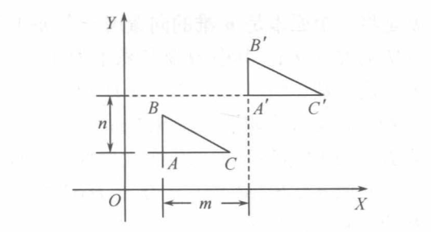

# 里程计仿真的理论基础

里程计的实现过程与机器人系统中的tf tree强绑定在了一起，而tf tree的内容又是依赖了ROS中比较成熟的坐标变换库[geometry2](https://github.com/ros2/geometry2)中tf2相关的内容。

tf2的实际上就是对机器人系统里各种坐标系之间的关系提供了管理和查询的功能，这个功能开发离不开坐标变换相关的理论基础。

我们在使用时，虽然可以不关心内部具体的实现，但是能大概知道其原理，对于这种工具库的使用也会变得如虎添翼般丝滑。

`本小节内容，参考上图的《计算机图形学》一书的第四章第一小节。更多内容感兴趣可以自行购买或加入 导航与仿真技术讨论群  获取电子资料临时参阅`

tf的实现是3D空间中的复杂操作，我们仿真器的里程计部分只涉及其中的2D空间相关的内容。

## 坐标变换基础

图形学中，实现图形变换时通常采用齐次坐标系来表示坐标值，这样可以方便地用变换矩阵实现对图形的变换。

所谓的齐次坐标表示法就是将一个原本是n维的向量用一个n+1维向量表示。例如，二维坐标点P(x,y)的齐次坐标为(H·x, H·y, H),其中H是任意不为0的比例系数。

引入齐次坐标之前，图形变换的运算形式既有矩阵加法，又有矩阵乘法。引入齐次坐标之后，图形变换的运算形式统一成表示图形的点集矩阵与某一变换矩阵进行矩阵相乘的单一形式。

2D导航中，里程计层面上只考虑二维平面中的内容，所以这这一小节中以二维几何变换进行展开。几何变换的形式包括五中基本形式：平移、比例、旋转、对称、错切。

这里提到的五种基本变换，变换矩阵都可以用如下的3 x 3矩阵来描述

$$
\left[\begin{array}{cc:c}
a & b & c\\
d & e & f\\
\hdashline g & h & i
\end{array}\right]
$$

根据不同的功能，可以将这个3 x 3的变换矩阵分成4个字块：

- 左上角的 2 x 2子块可实现比例、旋转、对称、错切四种基本变换
- 左下角的 1 x 2子块可实现平移变换
- 右上角的 2 x 1子块可实现投影变换
- 右下角的 1 x 1子块可实现整体比例变换

这里只对其中的平移与旋转叠加的复合变换内容进行展开，更多内容可以参阅上面提到的书目。

## 平移变换
平移是一种不产生形变而移动物体的刚体变换，如下图所示：

假定从点P平移到点P'，点P沿x方向的平移量为m，沿y方向的平移量为n，则变换后P'点的坐标值分别为：

$$
x' = x + m \\
y' = y + n
$$

构造平移矩阵T:

$$
\left[\begin{array}{c}
1 & 0 & 0 \\
0 & 1 & 0 \\
m & n & 1 \\
\end{array}\right]
$$

得到平移变换的矩阵运算表示为：

$$
\left[\begin{array}{c}
x' & y' & 1
\end{array}\right] = \left[\begin{array}{c}
  x + m & y + n & 1
\end{array}\right] = \left[\begin{array}{c}
  x & y & 1
\end{array}\right] \cdot \left[\begin{array}{c}
1 & 0 & 0 \\
0 & 1 & 0 \\
m & n & 1 \\
\end{array}\right]
$$

简写为: $P'=P·T$

显而易见，正是由于采用了齐次坐标表示法，才使得平移变换的处理由原本的加法变为了矩阵乘法，从而与其余四种几何变换的运算方式相统一。

## 旋转变换
基本的旋转变换是指将图形围绕坐标原点逆时针转动一个 $\theta$ 角度的变化，如下图所示：

假定 $P$ 点离原点的距离为 $\rho$ ， $P$ 点与x轴夹角 $\alpha$ ，如上面右图所示，则 $P$ 的坐标值为：

$$
x = \rho \cdot cos\alpha \\
y = \rho \cdot sin\alpha
$$

从 $P$ 点绕原点逆时针旋转 $\theta$ 角到 $P'$ 点，则变换后 $P'$ 点的坐标值为：

$$
x' = \rho \cdot cos(\alpha + \theta) = \rho \cdot cos\alpha cos\theta - \rho \cdot sin\alpha sin\theta \\
y' = \rho \cdot sin(\alpha + \theta) = \rho \cdot sin\alpha cos\theta + \rho \cdot cos\alpha sin\theta
$$

从而得到

$$
x' = x \cdot cos\theta - y \cdot sin\theta \\
y' = x \cdot sin\theta + y \cdot cos\theta
$$

构造旋转矩阵 $T$ :

$$
T = 
\left[\begin{array}{c}
  cos\theta & sin\theta & 0 \\
  -sin\theta & cos\theta & 0 \\
  0 & 0 & 1
\end{array}\right]
$$

得到旋转变换的矩阵运算表示为：

$$
\left[\begin{array}{c}
  x' & y' & 1
\end{array}\right] = 
\left[\begin{array}{c}
  x \cdot cos\theta - y\cdot sin\theta & x \cdot sin\theta + y \cdot cos\theta & 1
\end{array}\right] = 
\left[\begin{array}{c}
  x & y & 1
\end{array}\right] \cdot 
\left[\begin{array}{c}
  cos\theta & sin\theta & 0 \\
  -sin\theta & cos\theta & 0 \\
  0 & 0 & 1
\end{array}\right]
$$

简写为 $P' = P \cdot T$ 

## 复合变换

任何一个比较复杂的变换，都可以转换成若干个连续进行的基本变换。这些基本几何变换的组合成为复合变换，也称为级联变换。

设图形经过n次基本几何变换，其变换矩阵分别为T1, T2

则，经过T1变换后：

$$ 
\left[\begin{array}{c}
 x' & y' & 1 
\end{array}\right] =
\left[\begin{array}{c}
 x & y & 1 
\end{array}\right] \cdot T1
$$

经过T2变换后：

$$ 
\left[\begin{array}{c}
 x'' & y'' & 1 
\end{array}\right] =
\left[\begin{array}{c}
 x' & y' & 1 
\end{array}\right] \cdot T2 = \left[\begin{array}{c}
 x & y & 1 
\end{array}\right] \cdot T1 \cdot T2 = 
\left[\begin{array}{c}
 x & y & 1 
\end{array}\right] \cdot T 
$$

称 

$$ 
T=T1 \cdot T2 
$$

为复合变换矩阵。
该操作用在机器人运动时调整机器人在odom坐标系的位置。

## 逆变换与逆矩阵
所谓逆变换，就是变换过程相反的变换。

逆变换:设 $\rho$ 是一个线性变换，如果存在一个线性变换 $\sigma$ ，使得 $\rho \sigma = \sigma \rho = I$ ，(I是恒等变换)，则称 $\rho$ 变换可逆，其中 $\sigma$ 是 $\rho$ 的逆变换.若变换 $\rho$ 和变换
 $\sigma$ 对应的矩阵分别为 $A, B$ ，则有 $BA=AB=E_{2}$ 

逆矩阵:设 $A$ 是一个二阶矩阵，如果存在二阶矩阵 $B$ ，使得 $BA=AB=E_{2}$ ,则称矩阵 $A$ 可逆，其中 $B$ 为 $A$ 的逆矩阵.

一般地，设 $A$ 是一个二阶可逆矩阵，对应的线性变换为 $\rho$ ，由矩阵与线性变换的对应关系可以看出， $A$ 的逆矩阵就是 $\rho$ 的逆变换所对应的矩阵.

该操作用在机器人重定位时调整map与odom两个坐标系之间的关系。
