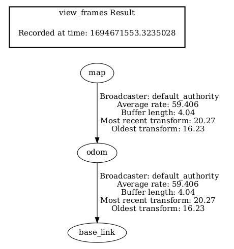

# 里程计仿真的设计和实现

## 功能设计


### 重新设计坐标系统



### 再议tf
[tf broadcaster](https://docs.ros.org/en/galactic/Tutorials/Intermediate/Tf2/Writing-A-Tf2-Broadcaster-Cpp.html)
```
  void handle_turtle_pose(const std::shared_ptr<turtlesim::msg::Pose> msg)
  {
    geometry_msgs::msg::TransformStamped t;

    // Read message content and assign it to
    // corresponding tf variables
    t.header.stamp = this->get_clock()->now();
    t.header.frame_id = "world";
    t.child_frame_id = turtlename_.c_str();

    // Turtle only exists in 2D, thus we get x and y translation
    // coordinates from the message and set the z coordinate to 0
    t.transform.translation.x = msg->x;
    t.transform.translation.y = msg->y;
    t.transform.translation.z = 0.0;

    // For the same reason, turtle can only rotate around one axis
    // and this why we set rotation in x and y to 0 and obtain
    // rotation in z axis from the message
    tf2::Quaternion q;
    q.setRPY(0, 0, msg->theta);
    t.transform.rotation.x = q.x();
    t.transform.rotation.y = q.y();
    t.transform.rotation.z = q.z();
    t.transform.rotation.w = q.w();

    // Send the transformation
    tf_broadcaster_->sendTransform(t);
  }

```


[tf listener](https://docs.ros.org/en/galactic/Tutorials/Intermediate/Tf2/Writing-A-Tf2-Listener-Cpp.html)

```
      if (turtle_spawned_) {
        geometry_msgs::msg::TransformStamped t;

        // Look up for the transformation between target_frame and turtle2 frames
        // and send velocity commands for turtle2 to reach target_frame
        try {
          t = tf_buffer_->lookupTransform(
            toFrameRel, fromFrameRel,
            tf2::TimePointZero);
        } catch (const tf2::TransformException & ex) {
          RCLCPP_INFO(
            this->get_logger(), "Could not transform %s to %s: %s",
            toFrameRel.c_str(), fromFrameRel.c_str(), ex.what());
          return;
        }

        geometry_msgs::msg::Twist msg;

        static const double scaleRotationRate = 1.0;
        msg.angular.z = scaleRotationRate * atan2(
          t.transform.translation.y,
          t.transform.translation.x);

        static const double scaleForwardSpeed = 0.5;
        msg.linear.x = scaleForwardSpeed * sqrt(
          pow(t.transform.translation.x, 2) +
          pow(t.transform.translation.y, 2));

        publisher_->publish(msg);
      } else {
        RCLCPP_INFO(this->get_logger(), "Successfully spawned");
        turtle_spawned_ = true;
      }

```
## 功能实现

## 效果验证

### 重定位

### 遥控器
